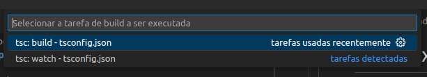

# Como executar um programa em TypeScript?

Nós temos duas formas, a primeira é uma forma não tão recomendada, mas para 
programas pequenos é funcional e ela é da seguinte forma:

```shell
$ tsc ./app.ts #Com isso tu irá fazer a transpilação do código de TS para JS.
$ node app.js #Já com isso faremos execução do código.
```

Já a segunda forma é criando o arquivo tsconfig.json com o seguinte comando:

```shell
$ tsc --init
```

e após isso compliar o código pelo vscode com **CTRL+SHIFT+B**



selecione a opção de build e de **ENTER**

Logo após isso execute o arquivo da seguinte forma

```shell
$ node app.js
```